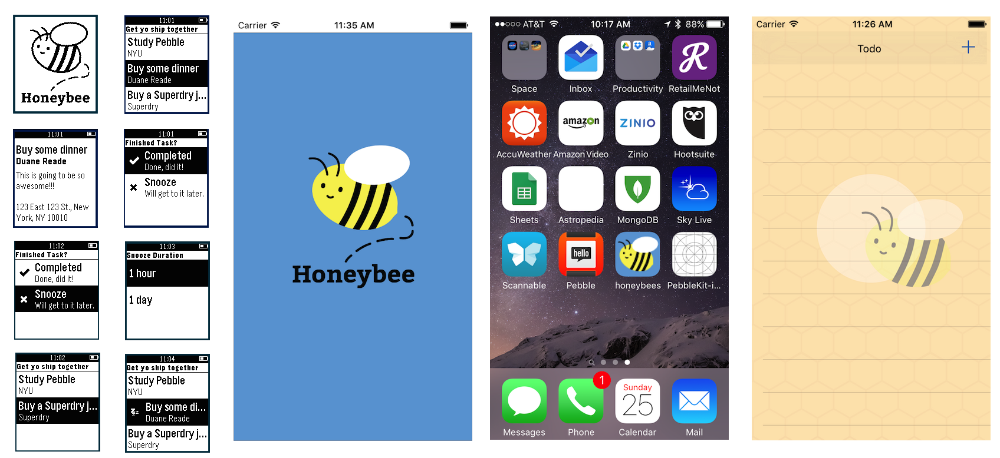

# Honeybee
An iOS and Pebble app to help keep the busy New Yorker on track.

#### What the app does
- Install the Honeybee task management app on the iPhone and the Pebble using the Pebble app store.
- Ensure that your Pebble is connected to your iPhone.
- Create a task in the task management app and select the location of where you task is to be accomplished on the iPhone.
- The app automatically updates your Pebble with the list you created on the iPhone.
- You can view your tasks on your Pebble watch and mark them as complete from there, which will update the list on your iPhone, as well.
- Additionally, when you are in proximity to the location of where you could accomplish your task, The iPhone sends a notification to your Pebble smartwatch, which in turn notifies you with a vibration that you are in range of the location that is relevant to completing your task.
- You may either complete the task or snooze it, which gives you the options of ignoring the alert of proximity for 1 hour or 1 day.

#### Technologies and tools used
- Created a geofence within a set radius of user's task location (wireless "fence" that you walked into an area and receive an alert) using the Google Maps API.
- Required researching different libraries that were written either in Swift 1 or Objective-C in order to learn how to integrate them with Swift 2 syntax.
- Used JavaScript with PebbleJS framework to write the Pebble Honey Bee app's UI/UX by doing quick emulation in both CloudPebble IDE and Pebble SDK in command line.
- Used Swift 2 to build the native task manager app for the iPhone.
- Used Balsamic for wireframing.
- Used Photoshop, Illustrator, HyperDither to design and export designs for use in both the iOS and Pebble apps.
 
##Team Members
####Michael Angelo
* GitHub: https://github.com/Yamikamisama
* LinkedIn: http://www.linkedin.com/pub/michael-angelo/9a/a93/1b0/
* Email: yamikamisama@gmail.com

####Steph Reaves
* GitHub:https://github.com/StephReaves
* LinkedIn: https://www.linkedin.com/in/stephreaves
* Email: stephanie.reaves@gmail.com 

####Yvonne Santiago
* GitHub: https://github.com/jbouzi12
* LinkedIn: https://www.linkedin.com/in/jensenbouzi
* Email: jensen.bouzi@gmail.com

####Robert Yang
* GitHub: https://github.com/unknownbreaker
* LinkedIn: https://www.linkedin.com/in/robwyang
* Email: rob.yang@gmail.com
